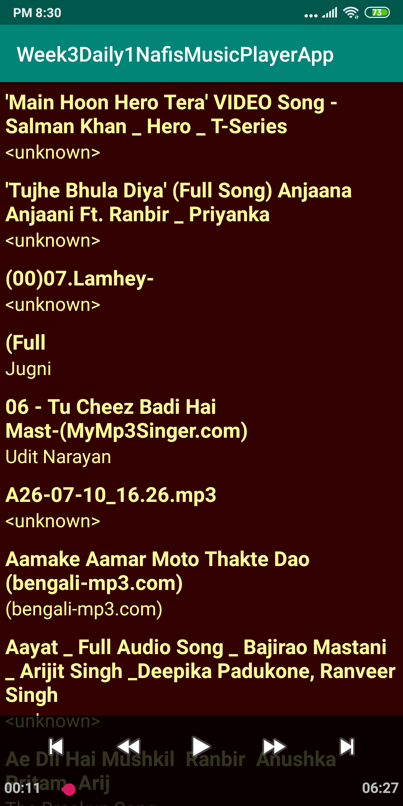
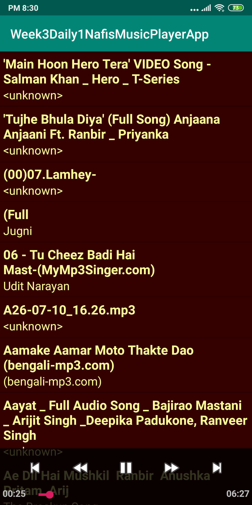
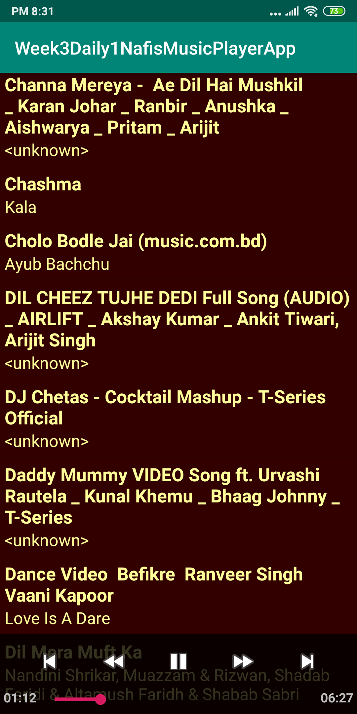

# Week3Daily1NafisMusicPlayerApp
A foreground service with notification that will play the music. The notification bar should be able to start, pause and stop the music.

Paused the song which was playing.

Playing the song.

All the songs in the listview.

